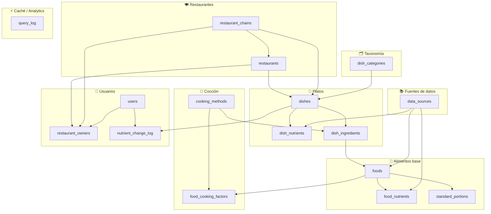
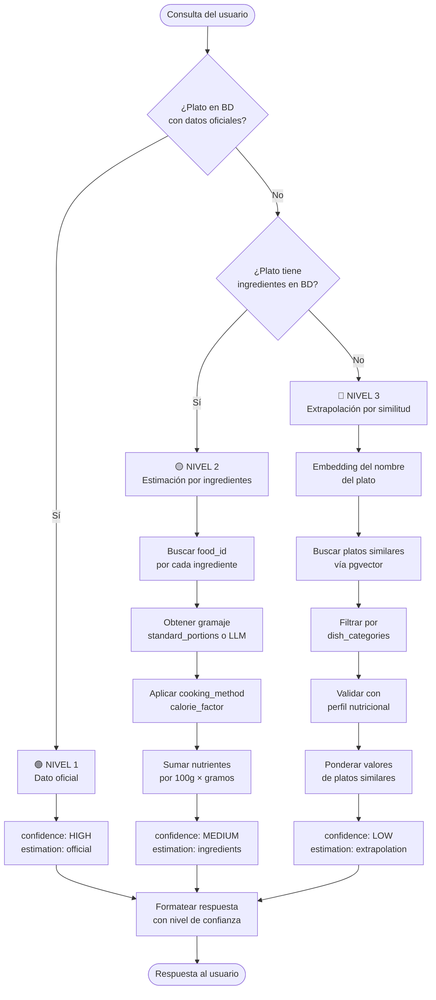

# FoodXPlorer — Modelo de Base de Datos

## Diagrama completo

```mermaid
erDiagram

  %% ─────────────────────────────────────────
  %% BLOQUE 1 — ALIMENTOS BASE
  %% ─────────────────────────────────────────

  data_sources {
    uuid    id PK
    varchar name
    varchar type          "official | estimated | scraped | user"
    text    url
    timestamp last_updated
  }

  foods {
    uuid    id PK
    varchar name
    varchar name_es
    text[]  aliases
    varchar food_group
    uuid    source_id FK
    varchar external_id   "ID en USDA, BEDCA..."
    vector  embedding     "pgvector 1536"
  }

  food_nutrients {
    uuid    id PK
    uuid    food_id FK
    decimal calories
    decimal proteins
    decimal carbohydrates
    decimal sugars
    decimal fats
    decimal saturated_fats
    decimal fiber
    decimal salt
    decimal sodium
    jsonb   extra         "micronutrientes v2"
    uuid    source_id FK
  }

  standard_portions {
    uuid    id PK
    uuid    food_id FK    "nullable"
    varchar food_group    "fallback si no hay food_id"
    varchar context       "plato principal | guarnición | postre"
    decimal portion_grams
    uuid    source_id FK
    text    notes
  }

  %% ─────────────────────────────────────────
  %% BLOQUE 2 — FACTORES DE COCCIÓN
  %% ─────────────────────────────────────────

  cooking_methods {
    uuid    id PK
    varchar name          "frito | hervido | horneado | crudo"
    decimal calorie_factor
    decimal protein_factor
    decimal fat_factor
    decimal carb_factor
    decimal water_loss_pct
    text    notes
  }

  food_cooking_factors {
    uuid    id PK
    uuid    food_id FK
    uuid    cooking_method_id FK
    decimal calorie_factor
    decimal protein_factor
    decimal fat_factor
    decimal carb_factor
    decimal water_loss_pct
    uuid    source_id FK
  }

  %% ─────────────────────────────────────────
  %% BLOQUE 3 — TAXONOMÍA
  %% ─────────────────────────────────────────

  dish_categories {
    uuid    id PK
    varchar name
    varchar name_es
    uuid    parent_id FK  "self-reference jerarquía"
    varchar cuisine_type  "italiana | española | asiática"
    int     typical_calories_min
    int     typical_calories_max
    vector  embedding     "pgvector 1536"
  }

  %% ─────────────────────────────────────────
  %% BLOQUE 4 — RESTAURANTES
  %% ─────────────────────────────────────────

  restaurant_chains {
    uuid    id PK
    varchar name
    varchar slug
    varchar country
    text    website
    text    logo_url
    boolean verified
    boolean managed_by_owner
  }

  restaurants {
    uuid    id PK
    uuid    chain_id FK   "nullable"
    varchar name
    varchar slug
    text    address
    varchar city
    varchar country
    decimal latitude
    decimal longitude
    varchar phone
    text    website
    varchar google_place_id
    boolean verified
  }

  %% ─────────────────────────────────────────
  %% BLOQUE 5 — PLATOS Y NUTRIENTES
  %% ─────────────────────────────────────────

  dishes {
    uuid    id PK
    uuid    chain_id FK       "nullable"
    uuid    restaurant_id FK  "nullable"
    uuid    category_id FK
    varchar name
    varchar name_normalized
    text    description
    text[]  allergens
    text[]  tags
    boolean is_active
    vector  embedding         "pgvector 1536"
  }

  dish_nutrients {
    uuid    id PK
    uuid    dish_id FK
    decimal portion_grams
    text    portion_description
    decimal calories
    decimal proteins
    decimal carbohydrates
    decimal sugars
    decimal fats
    decimal saturated_fats
    decimal fiber
    decimal salt
    jsonb   extra
    varchar confidence_level    "high | medium | low"
    varchar estimation_method   "official | ingredients | extrapolation"
    uuid    source_id FK
    text    source_url
    timestamp calculated_at
  }

  dish_ingredients {
    uuid    id PK
    uuid    dish_id FK
    uuid    food_id FK          "nullable"
    varchar ingredient_name     "nombre libre si no hay food_id"
    decimal grams
    varchar grams_source        "published | standard_portion | llm"
    uuid    cooking_method_id FK
    int     order_index
    text    notes
  }

  %% ─────────────────────────────────────────
  %% BLOQUE 6 — USUARIOS Y CONTRIBUCIONES
  %% ─────────────────────────────────────────

  users {
    uuid    id PK
    varchar email
    varchar username
    varchar role            "user | restaurant_owner | admin"
    varchar api_key
    varchar plan            "free | pro | business"
  }

  restaurant_owners {
    uuid    user_id FK
    uuid    chain_id FK     "nullable"
    uuid    restaurant_id FK "nullable"
    boolean verified
  }

  nutrient_change_log {
    uuid      id PK
    uuid      dish_id FK
    uuid      changed_by FK
    varchar   change_type   "create | update | verify | reject"
    jsonb     previous_data
    jsonb     new_data
    timestamp created_at
  }

  %% ─────────────────────────────────────────
  %% BLOQUE 7 — SOPORTE CACHÉ
  %% ─────────────────────────────────────────

  query_log {
    uuid    id PK
    varchar query_hash
    text    query_text
    uuid[]  result_dish_ids
    varchar estimation_method
    boolean response_cached
    timestamp created_at
  }

  %% ─────────────────────────────────────────
  %% RELACIONES
  %% ─────────────────────────────────────────

  foods                 ||--o{ food_nutrients         : "tiene"
  foods                 ||--o{ standard_portions      : "tiene raciones"
  foods                 ||--o{ food_cooking_factors   : "tiene factores"
  foods                 }o--o{ dish_ingredients       : "es ingrediente de"
  data_sources          ||--o{ foods                  : "fuente de"
  data_sources          ||--o{ food_nutrients         : "fuente de"
  data_sources          ||--o{ dish_nutrients         : "fuente de"
  data_sources          ||--o{ standard_portions      : "fuente de"
  data_sources          ||--o{ food_cooking_factors   : "fuente de"
  cooking_methods       ||--o{ food_cooking_factors   : "define"
  cooking_methods       ||--o{ dish_ingredients       : "aplica a"
  dish_categories       ||--o{ dishes                 : "clasifica"
  dish_categories       ||--o| dish_categories        : "parent"
  restaurant_chains     ||--o{ restaurants            : "tiene locales"
  restaurant_chains     ||--o{ dishes                 : "tiene platos"
  restaurants           ||--o{ dishes                 : "tiene platos"
  dishes                ||--o{ dish_nutrients         : "tiene nutrientes"
  dishes                ||--o{ dish_ingredients       : "tiene ingredientes"
  dishes                ||--o{ nutrient_change_log    : "historial"
  users                 ||--o{ nutrient_change_log    : "modifica"
  users                 ||--o{ restaurant_owners      : "gestiona"
  restaurant_chains     ||--o{ restaurant_owners      : "gestionada por"
  restaurants           ||--o{ restaurant_owners      : "gestionado por"
```

---

## Vista simplificada por bloques

```mermaid
graph TD
  subgraph FUENTES["📚 Fuentes de datos"]
    DS[data_sources]
  end

  subgraph ALIMENTOS["🥦 Alimentos base"]
    F[foods]
    FN[food_nutrients]
    SP[standard_portions]
  end

  subgraph COCCION["🍳 Cocción"]
    CM[cooking_methods]
    FCF[food_cooking_factors]
  end

  subgraph TAXONOMIA["🗂️ Taxonomía"]
    DC[dish_categories]
  end

  subgraph RESTAURANTES["🍽️ Restaurantes"]
    RC[restaurant_chains]
    R[restaurants]
  end

  subgraph PLATOS["🥗 Platos"]
    D[dishes]
    DNu[dish_nutrients]
    DI[dish_ingredients]
  end

  subgraph USUARIOS["👤 Usuarios"]
    U[users]
    RO[restaurant_owners]
    NCL[nutrient_change_log]
  end

  subgraph CACHE["⚡ Caché / Analytics"]
    QL[query_log]
  end

  DS --> F
  DS --> FN
  DS --> DNu
  F --> FN
  F --> SP
  F --> FCF
  CM --> FCF
  CM --> DI
  DC --> D
  RC --> R
  RC --> D
  R --> D
  D --> DNu
  D --> DI
  DI --> F
  D --> NCL
  U --> NCL
  U --> RO
  RC --> RO
  R --> RO
```

---

## Flujo del motor de estimación

```mermaid
flowchart TD
  A([Consulta del usuario]) --> B{¿Plato en BD\ncon datos oficiales?}

  B -->|Sí| C[🟢 NIVEL 1\nDato oficial]
  C --> C1[confidence: HIGH\nestimation: official]

  B -->|No| D{¿Plato tiene\ningredientes en BD?}

  D -->|Sí| E[🟡 NIVEL 2\nEstimación por ingredientes]
  E --> E1[Buscar food_id\npor cada ingrediente]
  E1 --> E2[Obtener gramaje\nstandard_portions o LLM]
  E2 --> E3[Aplicar cooking_method\ncalorie_factor]
  E3 --> E4[Sumar nutrientes\npor 100g × gramos]
  E4 --> E5[confidence: MEDIUM\nestimation: ingredients]

  D -->|No| F[🔴 NIVEL 3\nExtrapolación por similitud]
  F --> F1[Embedding del nombre\ndel plato]
  F1 --> F2[Buscar platos similares\nvía pgvector]
  F2 --> F3[Filtrar por\ndish_categories]
  F3 --> F4[Validar con\nperfil nutricional]
  F4 --> F5[Ponderar valores\nde platos similares]
  F5 --> F6[confidence: LOW\nestimation: extrapolation]

  C1 & E5 & F6 --> G[Formatear respuesta\ncon nivel de confianza]
  G --> H([Respuesta al usuario])
```